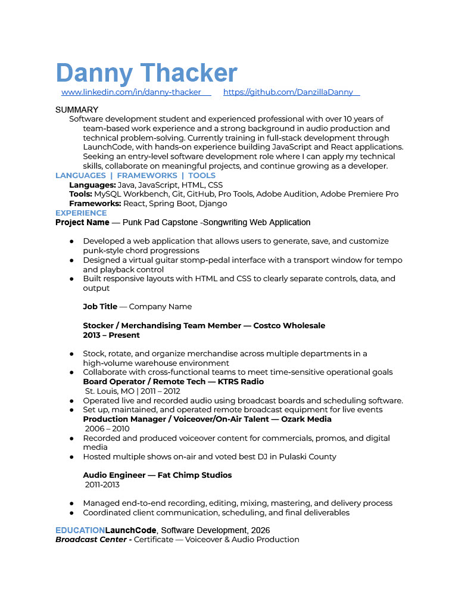

[Home](#intro) | [Resume](#resume--achievements) | [Projects](#projects) | [Contact](#contact)

## Intro

  
Hi, I’m Danny.  
I’m a software developer in training with skills in JavaScript, Java, SQL, and Git/GitHub, with a background in audio engineering and creative work.

I’m seeking a software developer role where I can build meaningful projects.

---

## Resume & Achievements

[Download my Resume](assets/Danny_Thacker_Resume_2026.pdf)

  

---

## Projects
## Punk Pad

https://github.com/DanzillaDanny/Punk-Pad-Danny-T

---

## Contact

Email: thenumberonesonsband@gmail.com  
GitHub: https://github.com/DanzillaDanny  
LinkedIn: https://www.linkedin.com/in/danny-thacker