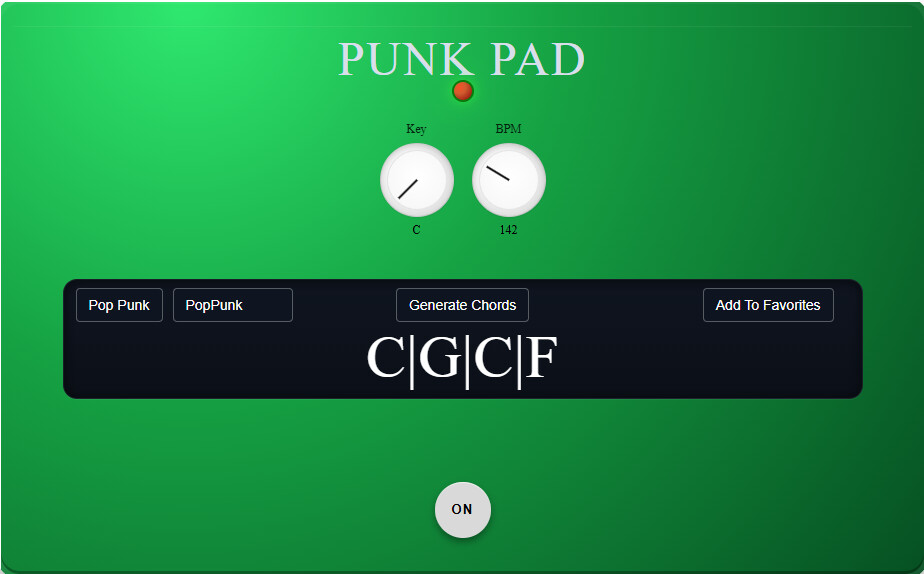

<link rel="stylesheet" href="index.css">

[Home](#intro) | [Resume](#resume--achievements) | [Projects](#projects) | [Contact](#contact)

## Intro

  
Hi, I’m Danny.  
I’m a software developer with skills in JavaScript, Java, SQL, CSS, and Git/GitHub. I have a background in audio engineering, songwriting, and love to create. I’m seeking a software developer role where I can build meaningful projects.

---

## Resume & Achievements

[Download my Resume](assets/Danny_Thacker_Resume_2026.pdf)

  

---

## Projects
## Punk Pad

https://github.com/DanzillaDanny/Punk-Pad-Danny-T

  

Punk Pad is a chord generator inspired by pop-punk, emo, and punk hits. It helps songwriters and guitar players of all skill levels quickly generate chord progressions commonly used in these genres, making it easier to start writing songs and experiment with new ideas.

---

## Contact

Email: thenumberonesonsband@gmail.com  
GitHub: https://github.com/DanzillaDanny  
LinkedIn: https://www.linkedin.com/in/danny-thacker